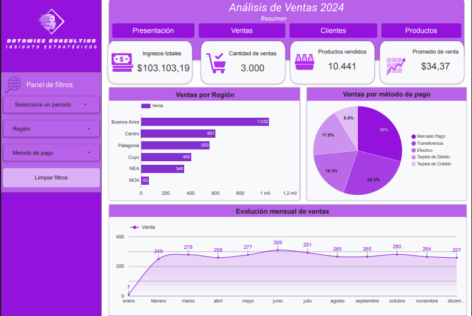
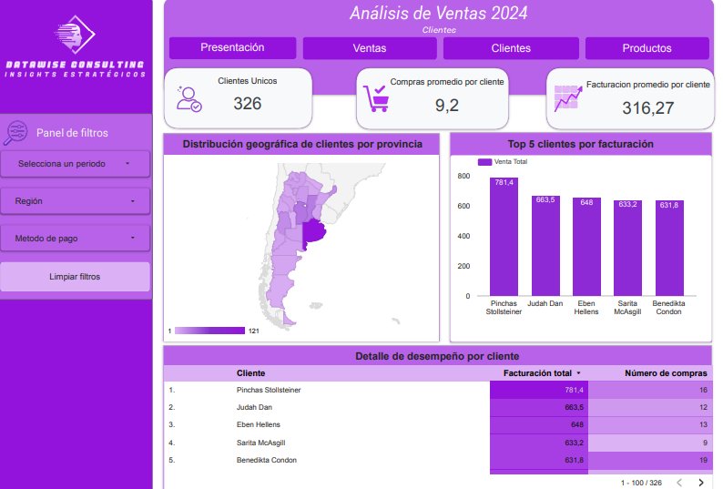
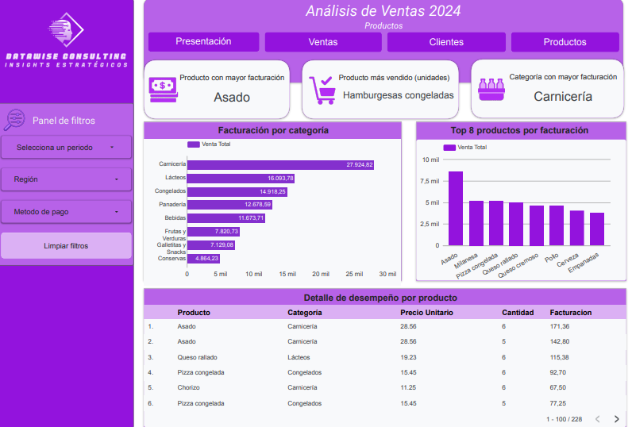

# Análisis de Ventas 2024 – DataWise Consulting

Dashboard interactivo de **Business Intelligence** desarrollado en **Looker Studio** para analizar el desempeño comercial durante el año 2024.  
El proyecto permite explorar ingresos, ventas, clientes y productos mediante visualizaciones claras, filtros dinámicos y KPIs clave para la toma de decisiones.

🔗 **Ver dashboard en Looker Studio:**  
https://lookerstudio.google.com/u/1/reporting/0eeab178-28f4-4d5b-bcf7-78eb6595d902/page/p_6vfljhhczd

---

## 📑 Tabla de Contenidos
- Introducción  
- Objetivos  
- Herramientas Utilizadas  
- Modelado y Preparación de Datos  
- Análisis  
- Hallazgos  
- Recomendaciones  
- Conclusión  

---

## 1. Introducción
Este proyecto presenta un **análisis integral de ventas del año 2024** para *DataWise Consulting*.  
Se desarrolló un dashboard en **Looker Studio** que centraliza información clave sobre **ventas, clientes, productos, regiones y métodos de pago**, facilitando una visión ejecutiva y operativa del negocio.

El dashboard está estructurado en **cuatro secciones principales**:
- Resumen Ejecutivo  
- Ventas  
- Clientes  
- Productos  

---

## 2. Objetivos
- Analizar los **ingresos totales y volumen de ventas** del año 2024.  
- Evaluar el desempeño comercial por **región y método de pago**.  
- Analizar el comportamiento de los **clientes** y su facturación.  
- Identificar **productos y categorías más relevantes**.  
- Brindar una herramienta visual e interactiva para la **toma de decisiones**.

---

## 3. Herramientas Utilizadas
- **Looker Studio**: Visualización y construcción del dashboard interactivo.  
- **Google Sheets / CSV**: Fuente de datos.  
- **Campos calculados**: Métricas, KPIs y segmentaciones personalizadas.  
- **Controles interactivos**: Filtros por período, región y método de pago.

---

## 4. Modelado y Preparación de Datos
Se realizó un proceso de preparación para garantizar la calidad y consistencia de la información:

- Normalización de campos numéricos (ventas, precios y cantidades).  
- Creación de métricas agregadas: ingresos totales, promedio de venta y facturación por cliente.  
- Clasificación de productos por categoría.  
- Estandarización de regiones y métodos de pago.  
- Configuración de filtros globales para análisis dinámico.

---

## 5. Análisis
### 🔹 Resumen Ejecutivo
**KPIs principales:**
- Ingresos totales: **$103.103,19**  
- Cantidad de ventas: **3.000**  
- Productos vendidos: **10.441**  
- Promedio de venta: **$34,37**

Incluye:
- Ventas por región  
- Ventas por método de pago  
- Evolución mensual de ventas  

---

### 🔹 Ventas

- Mayor volumen de ventas concentrado en **Buenos Aires y Centro**.  
- Predominio de **tarjetas y mercado pago** como método de pago.  
- Evolución mensual estable con picos en el primer semestre.

---

### 🔹 Clientes

**Indicadores clave:**
- Clientes únicos: **326**  
- Compras promedio por cliente: **9,2**  
- Facturación promedio por cliente: **$316,27**

Análisis de:
- Distribución geográfica de clientes  
- Top 5 clientes por facturación  
- Detalle de desempeño individual por cliente  

---

### 🔹 Productos

- Producto con mayor facturación: **Asado**  
- Producto más vendido (unidades): **Hamburguesas congeladas**  
- Categoría con mayor facturación: **Carnicería**

Incluye:
- Facturación por categoría  
- Top 8 productos por facturación  
- Tabla de detalle por producto (precio, cantidad y facturación)

---

## 6. Hallazgos
- Las ventas se concentran principalmente en **categorías alimenticias esenciales**.  
- Un grupo reducido de clientes genera un alto porcentaje de la facturación.  
- Existen diferencias claras de desempeño por región.  
- La estacionalidad influye en la evolución mensual de ventas.

---

## 7. Recomendaciones
- Potenciar estrategias comerciales en las regiones con mayor rendimiento.  
- Fidelizar a los clientes top con acciones específicas.  
- Optimizar el stock de las categorías más rentables.  
- Analizar oportunidades de crecimiento en regiones con menor participación.

---

## 8. Conclusión
El dashboard de **Análisis de Ventas 2024 – DataWise Consulting** permite obtener una visión clara, estructurada y accionable del desempeño comercial.  
Gracias a **Looker Studio**, el análisis es interactivo, dinámico y orientado a la toma de decisiones estratégicas.

Este proyecto forma parte del curso de **Business Intelligence - Talento Tech**.